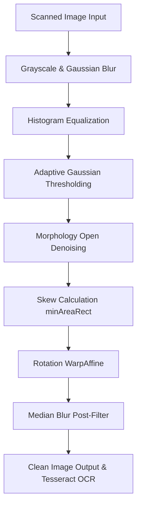

# Scanned Document Clean & OCR Processor

A Django-powered local web application that cleans scanned document images, corrects their orientation (deskewing), removes uneven illumination/shadows, and performs optical character recognition (OCR) to generate searchable PDFs and plain text files. Built specifically to handle **English** and **Bengali (বাংলা)** documents.

---

## 🚀 Key Features

- **Advanced Image Preprocessing**: A multi-stage pipeline using **OpenCV** and **NumPy** to clean scans:
  - **Denoising**: Initial Gaussian blurring to eliminate high-frequency scanner noise.
  - **Shadow & Lighting Correction**: Local thresholding and histogram equalization (CLAHE) to normalize uneven scan lighting.
  - **Skew Correction (Deskew)**: Automatically detects the tilt angle of text using bounding box contours (`cv2.minAreaRect`) and rotates the document straight.
  - **Binarization**: Adapts pixels to clean black-and-white using Gaussian adaptive thresholding.
  - **Artifact Removal**: Morphological opening clears remaining speckles.
- **Asynchronous Batch Processing**: Process entire directories of images in the background without blocking the web page.
- **Live Progress Tracking**: Monitored via a polling API that updates progress bars, percentage completed, and current file name in real-time.
- **Multi-Language OCR**: Fully configured to recognize English and Bengali scripts simultaneously via **Tesseract OCR**.
- **Formatted PDF Output**: Builds multi-page searchable PDFs utilizing ReportLab, with proper font registration for complex Bengali scripts.
- **Native Folder Browser Dialog**: Integrates Python's native Tkinter dialog to browse folders locally directly from the browser interface.
- **Local explorer link**: Allows opening the output directory directly in Windows Explorer after a completed job.

---

## 🛠️ Project Structure

```text
Scanned_Documents_Clean/
│
├── manage.py                        # Django entry point
├── requirements.txt                  # Python dependencies
├── .env                              # Environment configuration (Paths & Secrets)
├── document_clean_run_server.bat     # Windows batch script to launch the app
│
├── ocr_app/                         # Project settings
│   ├── settings.py                  # Settings referencing .env vars
│   └── urls.py                      # Global routing
│
├── processor/                       # App logic & UI
│   ├── ocr_core.py                  # Core image cleanup and pytesseract/ReportLab logic
│   ├── views.py                     # Job management threads and API endpoints
│   ├── forms.py                     # Input validation for folder paths
│   ├── urls.py                      # Local app routing
│   ├── templates/                   # HTML templates (base, index, status)
│   └── static/                      # Styling assets (modern dark glassmorphism styles)
│
└── fonts/                           # Noto Sans Bengali TTF file directory
```

---

## 📋 Prerequisites & Installation

### 1. System Dependencies
- **Python 3.10+**
- **Tesseract OCR Engine**:
  - Download and install Tesseract OCR for Windows (e.g., from UB Mannheim).
  - Ensure you download the **Bengali language training data** (`ben.traineddata`). Place it inside the `tessdata` directory of your Tesseract installation (typically `C:\Program Files\Tesseract-OCR\tessdata`).

### 2. Python Dependencies
Create a virtual environment and install the required modules:

```bash
# Create virtual environment
python -m venv env

# Activate the virtual environment
# On Windows:
.\env\Scripts\activate

# Install requirements
pip install -r requirements.txt
```

---

## ⚙️ Configuration (`.env`)

Create a `.env` file in the root directory and specify the paths corresponding to your system environment:

```env
SECRET_KEY=your_django_secret_key_here
BENGALI_FONT_PATH=F:\Scanned_Documents_Clean\fonts\NotoSansBengali-VariableFont_wdth,wght.ttf [Modify the path if needed]
TESSERACT_CMD=C:\Program Files\Tesseract-OCR\tesseract.exe [Modify the path if needed]
```

*Note: Ensure paths match the location of your Tesseract executable and downloaded font file.*

---

## 🏃 Running the Application

### Option A: Windows Batch Script (Recommended)
Double-click `document_clean_run_server.bat` in the root folder. It activates the local environment and starts the server on port `8006`.

### Option B: Command Line
From the root directory with virtual environment activated:

```bash
python manage.py runserver 8006
```

Once the server starts, navigate to:
👉 **[http://127.0.0.1:8006](http://127.0.0.1:8006)**

---

## 🔍 Preprocessing Pipeline Details

The preprocessing workflow inside [ocr_core.py](Scanned_Documents_Clean/processor/ocr_core.py) executes the following sequence:



1. **`cv2.GaussianBlur`**: Smooths the image to remove scanning/salt-and-pepper noise.
2. **`cv2.equalizeHist`**: Enhances overall document contrast.
3. **`cv2.adaptiveThreshold`**: Isolates text from non-uniform dark background segments using Gaussian calculation.
4. **`cv2.morphologyEx`**: Applies a morphology open filter to clean small speckle artifacts.
5. **`cv2.minAreaRect`**: Measures the rotation angle of coordinates relative to horizontal layout alignment.
6. **`cv2.warpAffine`**: Rotates the image back to direct upright layout alignments.
7. **`cv2.medianBlur`**: Final filter pass to smoothen text characters before sending them to Tesseract.
